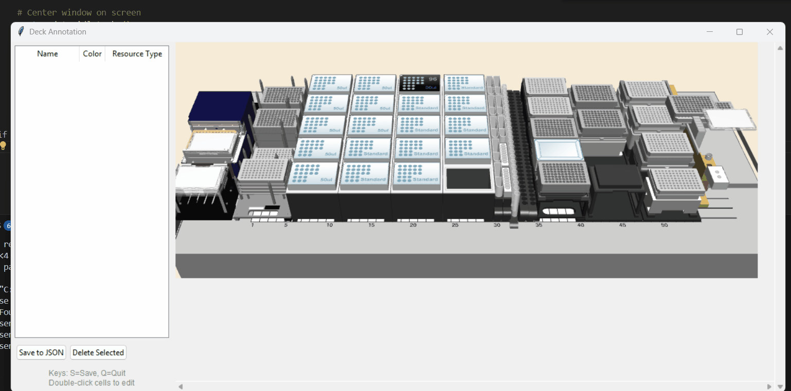

# Protocol GUI

The protocol GUI provides an interface for operators to select steps and input parameters, run simulations,
and displays loading dialogues that visually indicate the required positions and volumes of reagents.


To create a new protocol, create a subclass of the `Protocol` class with the relevant input parameters,
and include an `available_steps` attribute that maps step names to function names.

```python
class TenXGEXLibraryPrepProtocol(Protocol):
    
    def __init__(self, num_samples=8, sample_volume=10, pcr_cycles=12, simulation=False, device_simulation=False):

```

Run the protocol with `run_protocol()`
```python
if __name__=='__main__':
    TenXGEXLibraryPrepProtocol.run_protocol(simulation=True)
    generate_tadm_report()
```

## Step annotation

Create an `available_steps` attribute that maps step names to function names
```python
self.available_steps = [
    ("Initialize System", "initialize"),
    ("Fragmentation, End Repair & A-tailing", "fragmentation_end_repair_atailing"),
    ("Post Fragmentation SPRIselect", "post_fragmentation_spriselect"),
    ("Adapter Ligation", "adapter_ligation"),
    ("Post Ligation Cleanup", "post_ligation_cleanup"),
    ("Sample Index PCR", "sample_index_pcr"),
    ("Final Size Selection", "final_size_selection")
]
```

## Consumables and tracked resources

Declare labware containing reagents with `ReagentTracked...` resource types.
```python
self.CAR_VIALS_SMALL = layout_item(self.lmgr, ReagentTrackedEppiCarrier32, 'CAR_VIALS_SMALL')
self.CPAC_Reagents = layout_item(self.lmgr, ReagentTrackedPlate96, 'CPAC_HSP_0001')
```

Label reagents in containers with `assign_reagent_map(...)` with the name and position of the reagent.
```python
self.fragmentation_buffer_positions = self.CAR_VIALS_SMALL.assign_reagent_map('FragmentationBuffer', [0])
self.fragmentation_enzyme_positions = self.CPAC_Reagents.assign_reagent_map('FragmentationEnzyme', [0])
```

Assign tracked reagent containers to the appropriate attributes `self.tracked_reagent_vessels`, `self.tracked_tips`, `self.stacked_resources`.
These attributes will be consumed by the `Protocol` base class.
```python
self.tracked_reagent_vessels = [
    self.CAR_VIALS_SMALL, self.CPAC_Reagents, self.RGT_01, self.RGT_02, self.EthanolReservoir
]

self.tracked_tips = [self.tracked_tips_50uL, self.tracked_tips_300uL]
self.stacked_resources = [self.HSP_Stack, self.Lid_Stack, self.MIDI_Stack]
```


## Deck Annotation Tool

The deck annotation tool is used for labeling a screenshot of a layfile with the appropriate
resource names as they appear in the layfile. The deck annotation tool should be run
in a `loading` subdirectory of the protocol directory containing a png screenshot of the
associated layfile.




project/
├── protocol.py
└── loading/
    └── deck.png

```bash
cd loading
deck-annotator deck.png
```

project/
├── protocol.py
└── loading/
    └── deck.png
    └── deck_regions.json
